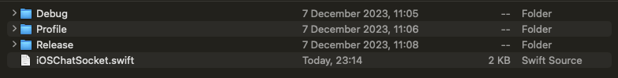
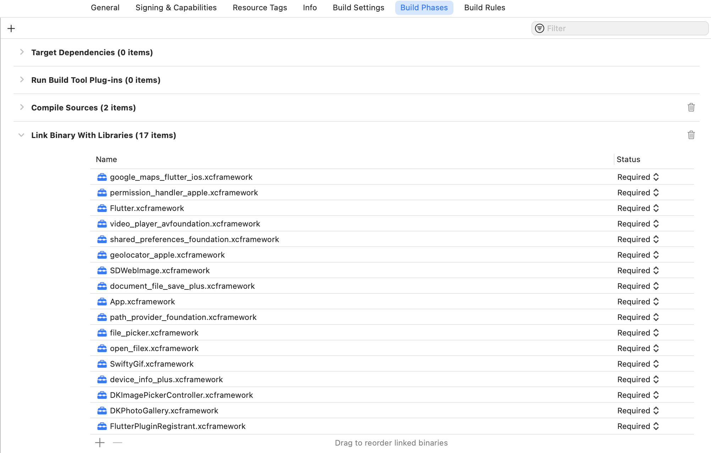
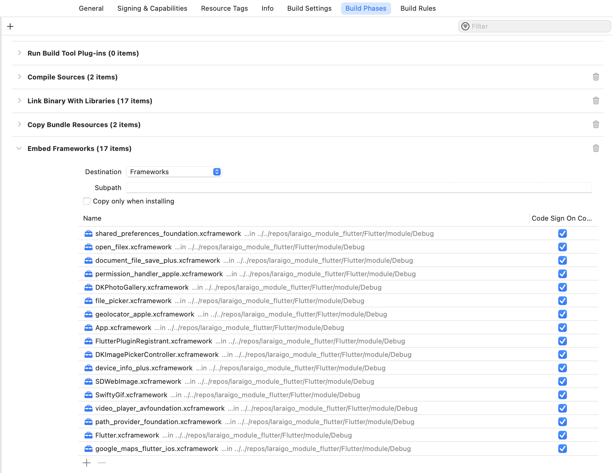

# Laraigo Chat Module iOS

A laraigo chat module for ios native development

## Installation

First download the repository from the github repository. After the download you will have four folders, an iOS file and also an assets folder that you could ignore, extract it wherever you want.

<!--  -->

Secondly, you will go to the root of your ios project. In this case I will use an empty project. Go to **Runner > Build Phases** and add this dependencies into **Build Phases > Link Binary With Libraries**

Drag and drop the framework for the same build as shown in the image below on Link Binary With Libraries.

In third place, you will go to the root of your ios project. In this case I will use an empty project. Go to **Runner > Build Phases** and add this dependencies into **Build Phases > Embed Frameworks**

Drag and drop the frame for the same build as shown in the image below on Embed Frameworks.

If you do not have the location of Embed Frameworks, generate a new Build Phase with that name:
Go to **Runner > Build Phases > + > New Copy Files Phase**

and

Creditos: [Jorge Casanova](https://github.com/jorgecasanovadev)
